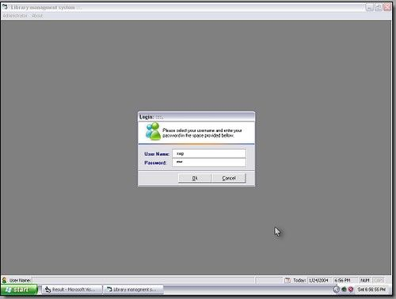



## Login using ms access database\.

### Description

This code is just a simple attractive user validation... using msaccess database.Now you can add this to your project very easily.
 
### More Info
 

             |
---                |---
**Submitted On**   |2006-01-18 23:01:46
**By**             |[Gurung Santos](https://github.com/Planet-Source-Code/PSCIndex/blob/master/ByAuthor/gurung-santos.md)
**Level**          |Intermediate
**User Rating**    |4.0 (8 globes from 2 users)
**Compatibility**  |VB 6\.0
**Category**       |[Databases/ Data Access/ DAO/ ADO](https://github.com/Planet-Source-Code/PSCIndex/blob/master/ByCategory/databases-data-access-dao-ado__1-6.md)
**World**          |[Visual Basic](https://github.com/Planet-Source-Code/PSCIndex/blob/master/ByWorld/visual-basic.md)
**Archive File**   |[Login\_usin197886392006\.zip](https://github.com/Planet-Source-Code/gurung-santos-login-using-ms-access-database__1-64588/archive/master.zip)

